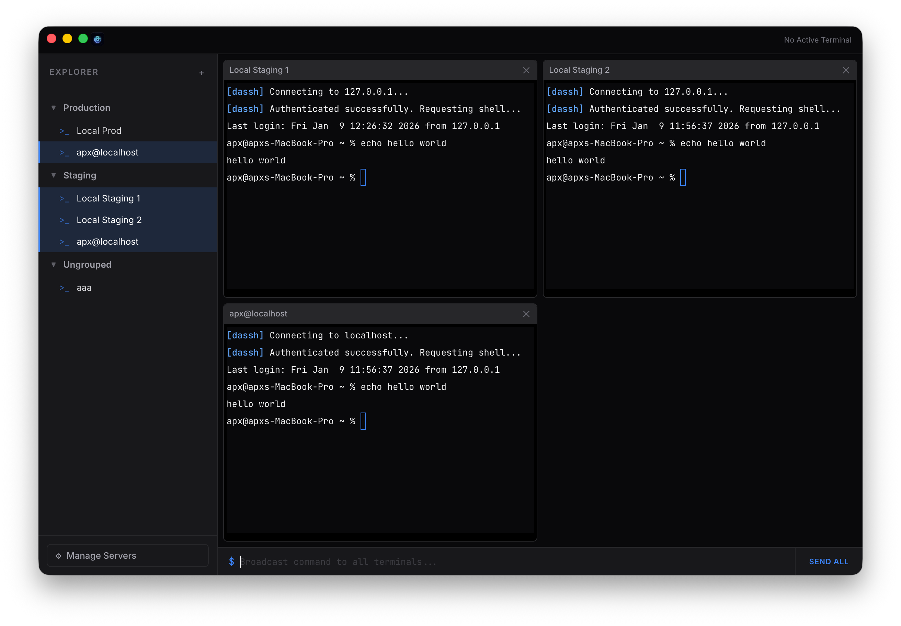

<p align="center">
  
</p>

# DASSH

**DASSH** is a premium, modern SSH server management application and terminal orchestrator built with Electron and React. Designed for developers and system administrators who need a high-performance, visually stunning workspace for managing multiple remote sessions.




---

## ✨ Features

- **Multi-Terminal Grid:** Connect to multiple servers simultaneously in a responsive, high-performance terminal grid powered by `xterm.js`.
- **SFTP File Manager:** Integrated SFTP client to browse, download, upload, and delete server files.
- **Integrated Split-Pane:** A dedicated file explorer alongside every terminal window for per-server management.
- **Cross-Server Transfer:** Direct server-to-server file transfer support by dragging items between panels.
- **Global Orchestration:** Broadcast commands to all active terminals at once with the built-in command bar—perfect for batch updates and log tailing.
- **Premium Zinc UI:** A sleek, dark-mode design system following premium aesthetic principles, featuring vibrancy effects on macOS and a curated Zinc palette.
- **Advanced Authentication:** Full support for SSH Private Key authentication with a native file picker, alongside standard password-based login.
- **Server Explorer:** Organize your infrastructure with custom grouping and a dedicated management panel.
- **Robust Persistence:** Automatically saves your connection details and group structures to a local JSON database.
- **macOS Native Feel:** Deep integration with macOS, including "hiddenInset" traffic light controls and vibration-aware layout.

## 🚀 Tech Stack

- **Frontend:** React, TypeScript, Vite
- **Backend:** Electron (Main process orchestration)
- **SSH:** `ssh2`
- **Terminal Rendering:** `xterm.js` with `fitAddon`
- **State Management:** React Hooks & Atomic Refs for concurrency protection
- **Styling:** Vanilla CSS with a global Zinc-inspired design system

## 🛠 Getting Started

### Prerequisites

- [Node.js](https://nodejs.org/) (v16+ recommended)
- `npm` or `yarn`

### Installation

1. Clone the repository:
   ```bash
   git clone https://github.com/apx/dassh.git
   cd dassh
   ```

2. Install dependencies:
   ```bash
   npm install
   ```

### Development

Run the application in development mode with HMR (Hot Module Replacement):

```bash
npm run dev
```

### Building

Create production-ready bundles for the Electron main and renderer processes:

```bash
npm run build
```

The output will be located in the `dist` and `dist-electron` directories.

## 📂 Project Structure

```text
dassh/
├── electron/          # Main process logic (SSH Service, IPC, Window Management)
├── src/               # Renderer process (React components, Styling)
│   ├── components/    # Reusable UI components (ServerList, TerminalGrid, Modals)
│   ├── App.tsx        # Main application orchestrator
│   └── index.css      # Core Design System
├── public/            # Static assets
└── servers.json       # Local server connection storage
```

## 🛡 Security

DASSH handles your connection details locally.
- Private key paths are stored as references; the application does not store the private key contents directly in the database.
- Passwords are currently stored in plain text within `servers.json`; usage in sensitive environments should prioritize Private Key authentication.

## 📄 License

This project is licensed under the MIT License. See [LICENSE](LICENSE) for details.

---

Built with ❤️ for the SSH power user.
